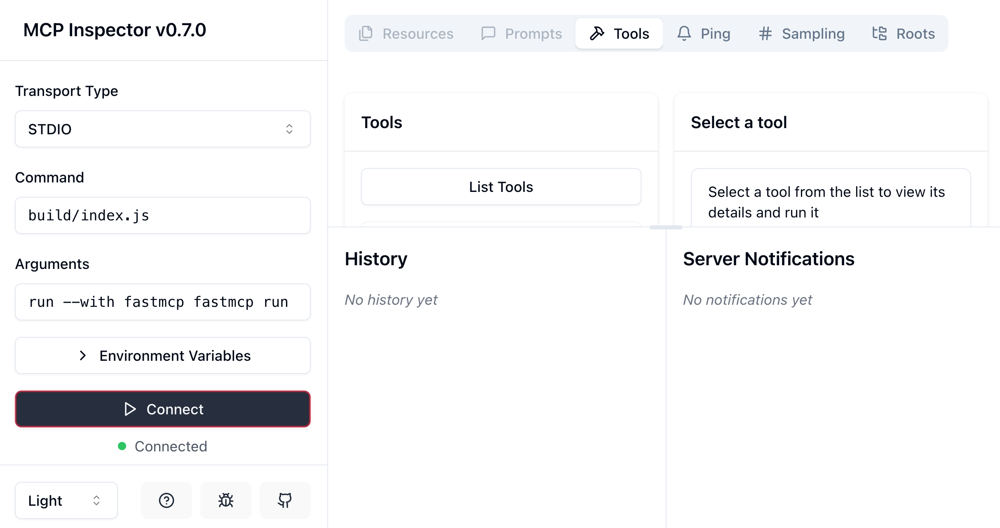

# weather-mcp



To install dependencies:

```bash
$ bun i

bun install v1.1.20 

$ bun run build
$ tsc && node -e "require('fs').chmodSync('build/index.js', '755')"

Checked 23 installs across 24 packages (no changes) [4.81s]
```

To run:

```bash
$ bun inspector

$ bun x @modelcontextprotocol/inspector build/index.js
Starting MCP inspector...
Proxy server listening on port 3000

🔍 MCP Inspector is up and running at http://localhost:5173 🚀
'755')"

Checked 23 installs across 24 packages (no changes) [4.81s]
ming-ders-MacBook.local💩➜  weather-mcp git:(main) ✗ bun inspector
$ bun x @modelcontextprotocol/inspector build/index.js
Starting MCP inspector...
Proxy server listening on port 3000

🔍 MCP Inspector is up and running at http://localhost:5173 🚀
```

This project was created using `bun init` in bun v1.1.20. [Bun](https://bun.sh) is a fast all-in-one JavaScript runtime.
